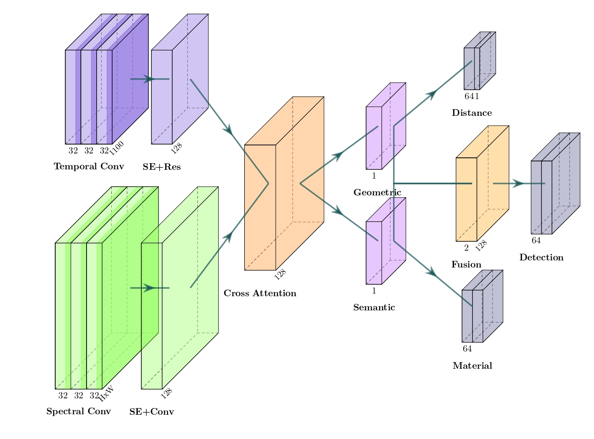

# damp-core

[](https://github.com/MosesTheRedSea/ros2-robot-audition-suite)
[](https://github.com/MosesTheRedSea/occlunet-sim2real)
[](https://github.com/MosesTheRedSea/occulnet-active-search)

> Developed at the Institute of Science Tokyo, Japan

Disentangled Acoustic Multi-task Perception (DAMP) is a unified neural framework for hidden object understanding through acoustic sensing, jointly performing occluded object detection, distance estimation, and material classification.

<br>
  
<p align="center">
  
</p>

## Dataset

The dataset contains **4,560** multi-channel acoustic recordings collected in a controlled indoor environment for occluded object perception.

[Download Dataset](https://drive.google.com/drive/folders/1RvxDkSgvDFVElYP8YYouXGkiUhqsmag4?usp=sharing)

| Property | Value |
|----------|------:|
| Total Recordings | **4,560** |
| Object Categories | **25** |
| Material Categories | **6** |
| Occlusion Configurations | **3** |
| Recording Environments | **1** |

### Material Categories

`Paper/Cardboard` · `Plastic` · `Metal` · `Ceramic` · `Glass` · `No Object`

### Evaluation

| Task | Accuracy | RMSE ↓ | MAE ↓ |
|------|:--------:|:------:|:-----:|
| Object Detection | **93.14%** | — | — |
| Material Classification | **96.52%** | — | — |
| Distance Estimation | — | **0.08 m** | **0.04 m** |


### Setup
```bash

# Clone the repository
git clone https://github.com/MosesTheRedSea/damp-core.git

cd damp-core

# Create virtual environment
uv pip install -r pyproject.toml

# Activate a virtual environment
source .venv/bin/activate

```

### Training

```bash
python train.py \
  --task all \
  --epochs 100 \
  --batch-size 128 \
  --lr 1e-3 \
  --weight-decay 5e-4
```
 
`--task` supports `all`, `det`, `mat`, or `dist` for joint or single-task ablation runs.
 
### License
 
Distributed under the MIT License. See [LICENSE](https://github.com/MosesTheRedSea/damp-core/blob/tsubame-research/LICENSE) for details.
 
### Acknowledgments
 
Developed at the **Institute of Science Tokyo**, Systems and Control Engineering, **Nakadai Lab**.